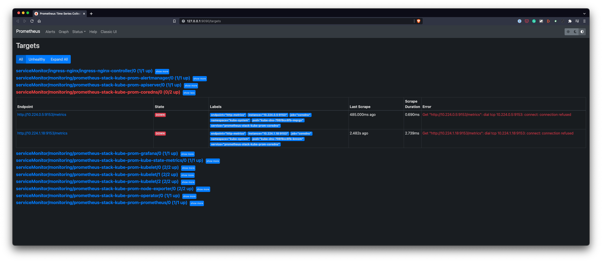
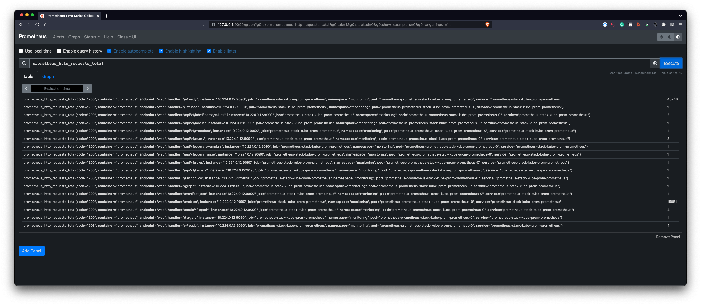
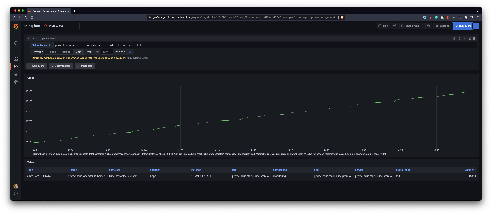
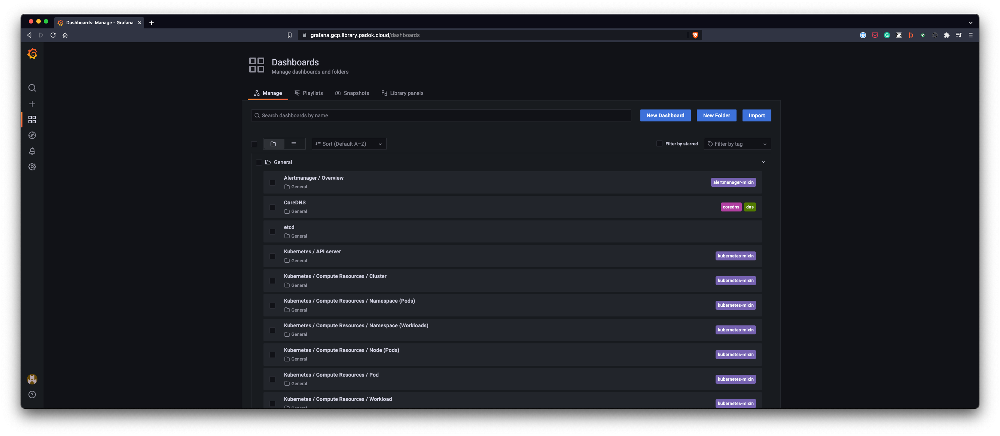

# Prometheus stack

Monitor your cluster with Prometheus, Grafana, and Alert Manager.

## Description

`prometheus-stack` deploys multiple tools to obtain an all in one functional monitoring stack.

The full documentation is available on [Prometheus Community's Github repo](https://github.com/prometheus-community/helm-charts/tree/main/charts/kube-prometheus-stack)

## Use-cases

- The **standard** use-case deploys the stack assuming the NGINX ingress
  controller and cert-manager are also deployed. Use the chart as is for this.
- The **with IAP** use-case deploys the stack assuming an IAP ingress controller is set up. Use the `values.iap.yaml`
  file for this in addition to the default `values.yaml` file.

## Usage

Don't forget to change these in the `values.yaml` file:

- `apps/prometheus-stack.yaml` -> `spec.source.repoURL`
- `helm/prometheus-stack/values.yaml` -> `kube-prometheus-stack.grafana.ingress.hosts.0`
- `helm/prometheus-stack/values.yaml` -> `kube-prometheus-stack.grafana.ingress.tls.0.hosts.0`

### Prometheus

1. Open a port forward on the prometheus service

    ```shell
    kubectl port-forward svc/prometheus-stack-kube-prom-prometheus 9090
    ```

2. Open <http://127.0.0.1:9090/targets> and check all are UP

    

    > Here we're using GKE plan v2 which is not using coreDNS
    > That's why the target is down
    > An issue is open <https://github.com/padok-team/library-kubernetes-catalog/issues/78>

3. Open <http://127.0.0.1:9090/graph> and search `prometheus_http_requests_total`

    

### Grafana

1. Open a port forward on the prometheus service (or the URL you defined)

    ```shell
    kubectl port-forward svc/prometheus-stack-grafana 8080:80
    ```

2. Open <http://127.0.0.1:8080/explore> and login

3. Query for `prometheus_operator_kubernetes_client_http_requests_total`

    

4. Open <http://127.0.0.1:8080/dashboards> and check that dashboards are present

    

5. Open one dashboard

### Alert Manager

1. Open a port forward on the prometheus service

    ```shell
    kubectl port-forward svc/prometheus-stack-kube-prom-alertmanager 9093
    ```

2. Open <http://127.0.0.1:9093/#/alerts> and check if you have some alerts
